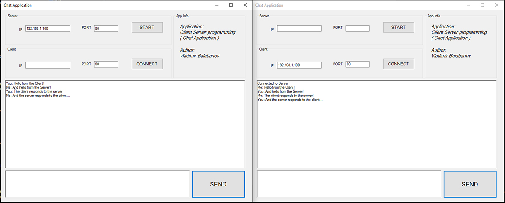

# Chat Application with TCP/IP sockets

Chat Application is a simple chat program developed in C# using Windows Forms and is based on a client-server architecture using TCP/IP sockets.. It allows communication between two instances of the program, one acting as the server and the other as the client.

## How to Use

1. **Build/Compile the Project:**
   - Open the project in your preferred C# development environment.
   - Build/Compile the project to generate the executable.

2. **Run the Server:**
   - Navigate to the `bin/Debug` directory in the project folder.
   - Run the executable to start the server.
   - Input the desired Port (e.g., 80) in the textbox.
   - Click the "Start" button to initiate the server.
   - The program will wait for incoming connections.

3. **Run the Client:**
   - Open another instance of the executable in the `bin/Debug` directory or on a different machine.
   - Input the IP address and Port of the server in the respective textboxes.
   - Click the "Connect" button to establish a connection with the server.

4. **Chatting:**
   - Once connected, you can send messages between the server and client.
   - Type your message in the lower text area and click the "Send" button.
   - The chat history will be displayed in the upper text area.

5. **Closing the Application:**
   - To close the application, use the standard window close button (X) or any other preferred method.

## Key Components:

- **TcpListener and TcpClient**:
  - TcpListener is used to listen for incoming connections on the server side.
  - TcpClient is used to initiate a connection to the server on the client side.

- **StreamReader and StreamWriter**:
  - StreamReader (STR) and StreamWriter (STW) are used for reading from and writing to the network stream, enabling bidirectional communication.

- **Background Workers**:
  - Background workers (backgroundWorker1 and backgroundWorker2) ensure that communication operations do not freeze the UI, running them on separate threads.

## Troubleshooting

- If the program freezes during server startup, ensure that the specified port is available and not blocked by other applications.
- If connection issues arise during client connection, double-check the IP address and port of the server.

## Dependencies

- .NET Framework v4.8

## Author

Grrr1337 aka. Vladimir Balabanov
