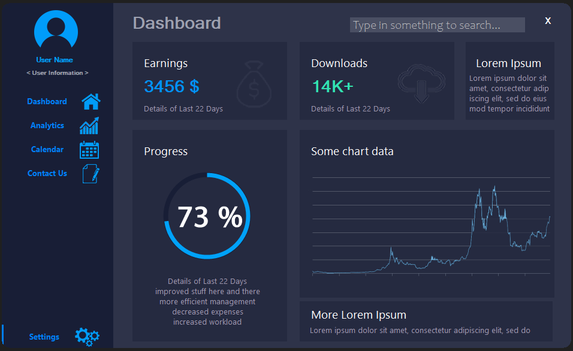

# Flat UI Dashboard Design

## Overview
Flat UI Dashboard Design is a visually appealing WinForm project that showcases a modern and flat user interface. While the project is primarily focused on the UI design, it provides an aesthetically pleasing representation of a dashboard with various buttons and panels.

## Screenshots



## Features
The project includes the following components:

### Buttons
1. **Dashboard**: Navigate to the main dashboard.
2. **Analytics**: Access analytics-related information.
3. **Calendar**: View a calendar component.
4. **Contact Us**: Provides contact information or form (not functional).
5. **Settings**: Access settings or configuration options.

### Panels
1. **Earnings**: Display information related to earnings.
2. **Downloads**: Showcase download-related statistics.
3. **Progress (CircularProgressBar)**: A circular progress bar for visual representation.
4. **ChartData**: Display charts or visual data representation.
5. **Additional Panel 1**: Custom additional panel for extra information.
6. **Additional Panel 2**: Another custom additional panel for additional content.

## Project Structure
The project follows a standard WinForm structure with organized folders and files. It is designed to be easily navigable for developers who may want to extend the functionality or customize the UI further.

## Usage
As of now, this project is a static representation of a UI design, and none of the buttons or panels are functional. Developers are encouraged to build upon this project, adding functionality as needed.

## Dependencies
- **.NET Framework 4.8**: The project is built on the .NET Framework version 4.8.
- **Circular Progress Bar NuGet Package**: Used for the circular progress bar component. You can install it using the following NuGet command:
    ```bash
    Install-Package CircularProgressBar
    ```

## Getting Started
To get started with the project, simply clone the repository and open it in your preferred IDE. You can explore the different forms, buttons, and panels to understand the structure and design.

## Contributors
Vladimir Balabanov / **Grrr1337**

## License
This project is licensed under the [MIT License](LICENSE), which means you are free to use, modify, and distribute the code for both personal and commercial use.