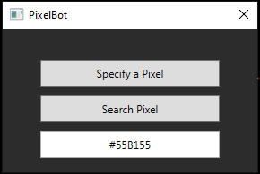

# PixelBot

PixelBot is a simple C# training application with a WPF (Windows Presentation Foundation) user interface that allows users to interact with screen pixels. The application enables users to specify and search for a pixel color on the screen, move the cursor to a specified pixel, and retrieve color information dynamically while hovering over the window.

## Features
1. Specify a Pixel
The application provides a button labeled "Specify a Pixel," which, upon clicking, prompts the user to move the mouse to the desired pixel and press ENTER/OK. The color information of the specified pixel is then displayed in a message box.

2. Move Cursor To Pixel
The "Move Cursor To Pixel" button allows users to search for a specific pixel color on the screen. Users can enter a hexadecimal color code (e.g., #ffffff), and the application will search for that color across all connected screens. When the pixel with the specified color is found, the application sets the mouse cursor to that position and performs a simulated left-click.

3. Real-time Color Information
The application dynamically updates the hexadecimal color code in a TextBox as the user hovers over the window. This feature allows users to see the color information of the pixel currently under the mouse cursor.

## Usage
1. **Specify a Pixel**:
    - Click the "Specify a Pixel" button.
    - Move the mouse to the desired pixel.
    - Press ENTER/OK.
    - View the color information in the displayed message box.
2. **Move Cursor To Pixel**:
    - Enter a hexadecimal color code in the TextBox.
    - Click the "Move Cursor To Pixel" button.
    - The application will search for the specified color across all screens.
    - If found, the mouse cursor is set to that position, and a left-click is - simulated.
3. **Real-time Color Information**:
    - Hover over the window, and the TextBox will display the hexadecimal color code of the pixel under the mouse cursor.
## Requirements
.NET Framework
Installation
Clone the repository or download the source code.
Open the solution in Visual Studio or your preferred C# development environment.
Build and run the application.

## Notes
Ensure that the application has the necessary permissions to capture the screen and simulate mouse events.
The application utilizes Windows Forms functions for mouse event simulation.

## Contributors
Vladimir Balabanov

## License
This project is licensed under the MIT License