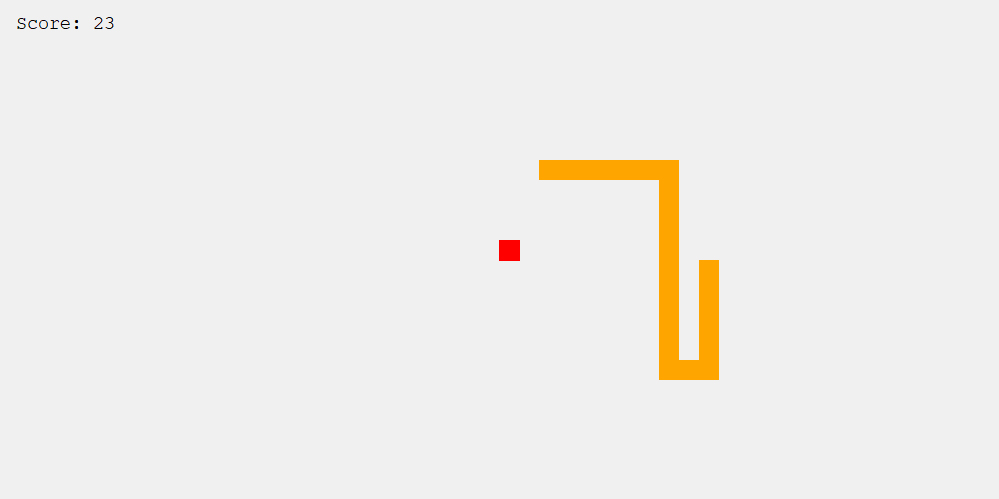

# Snake Game

Snake Game is a simple WinForm-based implementation of the classic Snake game in C#. The game features a snake that moves around the Winform canvas, eating food to grow longer. The goal is to achieve the highest score possible without colliding with the snake's own body or the edges of the game board.

## Game Preview

## How to Play

1. **Compile and Run:**
   - Open the solution in your preferred C# development environment.
   - Compile and run the project to start the game.

2. **Controls:**
   - Use arrow keys (Up, Down, Left, Right) to control the snake's direction.
   - Press Enter to quit the game.
   - Press Space to pause the game and display game information.

3. **Game Rules:**
   - The snake starts with a length of 1.
   - Eating food increases the snake's length and score.
   - The game ends if the snake collides with its own body or the game board edges.

4. **Score Display:**
   - The current score is displayed at the top of the canvas window.

## Customization

- You can easily customize the game settings such as the size of the game board, speed, and appearance by modifying variables in the code.

## Dependencies

- .NET Framework v4.8

## Author

Grrr1337 aka. Vladimir Balabanov
