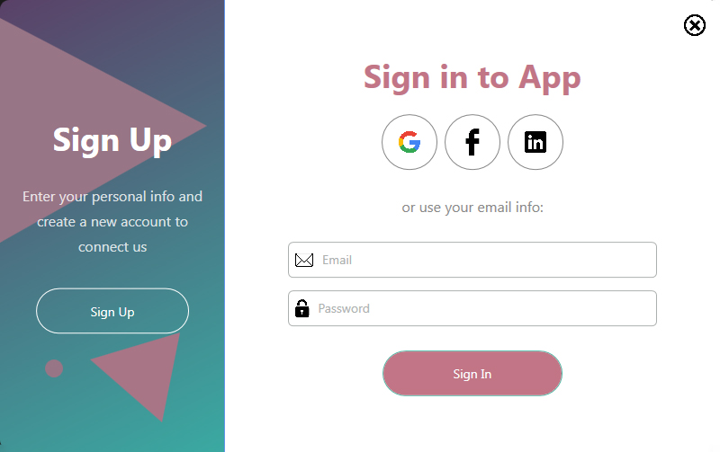

# WPF Login UI

WPF Login UI is a Windows Presentation Foundation (WPF) project implemented in C# that provides a stylish and user-friendly interface for user authentication. This project serves as a practice exercise for studying XAML and WPF, showcasing various styles for buttons, text blocks, and input fields to enhance the overall visual appeal.

## How to Use

1. **Clone or Download the Project:**
   - Clone the repository or download the project files to your local machine.

2. **Open in Visual Studio:**
   - Open the solution file (`WPF Login UI.sln`) in Visual Studio or your preferred C# development environment.

3. **Build/Compile the Project:**
   - Build/Compile the project to generate the executable.

4. **Run the Application:**
   - Set the `WPF_Login_UI` project as the startup project.
   - Run the application to see the stylish login interface.

5. **Explore the UI:**
   - The UI features various styles for text blocks, buttons, and input fields.
   - Buttons have different styles for normal, mouse-over, and mouse-captured states.

6. **Interact with the UI:**
   - Click on the "Sign Up" button to see the styling for sign-up elements.
   - Explore the text hints and input fields with associated styles.

7. **Close the Application:**
   - To close the application, you can use the standard window close button (X) or any other preferred method.

## Key Styles Implemented:

- **Title Text Style (`titleText`):**
  - Large and bold font size for titles.

- **Normal Text Style (`normalText`):**
  - Medium-sized font for regular text with specified line height and text wrapping.

- **Button Style (`button`):**
  - Stylish button with transparent background and mouse-over effects.

- **Circular Button Style (`buttonCircle`):**
  - Circular buttons with different background colors on mouse-over and mouse-captured states.

- **Text Hint Style (`textHint`):**
  - Stylish hint text for input fields.

- **TextBox Style (`TextBox`):**
  - Styled input fields resembling textboxes with transparent borders.

- **Main Button Style (`mainbutton`):**
  - Larger button with a distinct color scheme suitable for main actions.

- **Close Image Style (`imgClose`):**
  - Image style for close button with a scaling effect on mouse-over.

## Dependencies

- .NET Framework v4.8

## Author

Grrr1337 aka. Vladimir Balabanov
